# Zenyth PolisinT

[Zenyth PolisinT](https://furiocolombo.github.io/zenyth-polisint/) is a javascript semi-modular polyphonic synthesizer powered by Tone.js and implemented using the framework Vue.  
Zenyth is thought as a playful yet powerful tool to to discover modular synthesis. Its lighthearted exploration-based interface encourages the user to discover its functionalities by trying himself all blocks and routing options.

    

    <a href="https://www.youtube.com/watch?v=3jTYMbAtMqI">Presentation Video</a>
     
    <a href="https://www.youtube.com/watch?v=cjMXcdHnGRU">Demo</a>

 

## How to use it
  - Online Version [here](https://furiocolombo.github.io/zenyth-polisint/)
  - Locally: Clone git repo and run the following command in the project terminal:
  1. `npm install`
  2. `npm update`
  3. `npm run serve` to run development build
  OR
  3. `npm run build`, `npm install -g serve`, `serve -s dist` to run release build

 

Play the synth with your computer keyboard: `[a,w,s,e,d,f,t,g,y,h,u,j,k,o,l,p,ò,à]` 

Or connect a MIDI keyboard and reload the page!

(Connecting more than one MIDI/audio device could interfere with MIDI)
  
 

## Features
Zenyth PolisinT features four tipes of synthesis engines, a noise generator, three filter chains, and three effects chains. On top of that five dynamically assignables Modulators and a main ADSR Envelope allow to shape the sound further and produce crazy noises.

### Oscillators
|                                                     |   |  |  |
|-----------------------------------------------------|---|---|---|
| 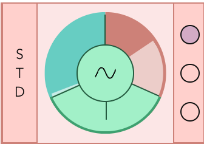  | Synth Engine: Shift+Click to remove, click "+" to add |    | Synth Engine Selector   | 
|                           |  Waveform Selector (change clicking)  |    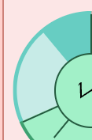 |   Left Slider: Noise Volume | 
|                      |  Right Slider: Oscillator Volume  |    |  Synth Routing: Select filter chains clicking on the dots (more chains can be selected for each Synth Engine)  | 
|  |  Oscillator Tuning |

 
    
### Filters
Three parallel Filter Chains (Horizontal)

|   |   |                                     |  |
|---|---|-------------------------------------|---|
| 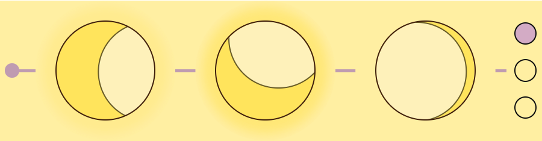|  Low Pass, Band and High Pass filters in serie | 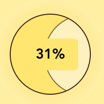  | Drag Horizonatally to change frequency, vertically to change amount and resonance |  
| 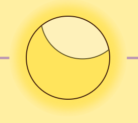|  Resonance/amount rapresented by glow around each filter |  |   Filter Routing: Select Fx Chain by clicking on the dots (more chains can be selected for each Filter Chain) |

 

### Effects
Three parallel Fx Chains (Vertical)

|   |   |  |  |
|---|---|---|---|
| 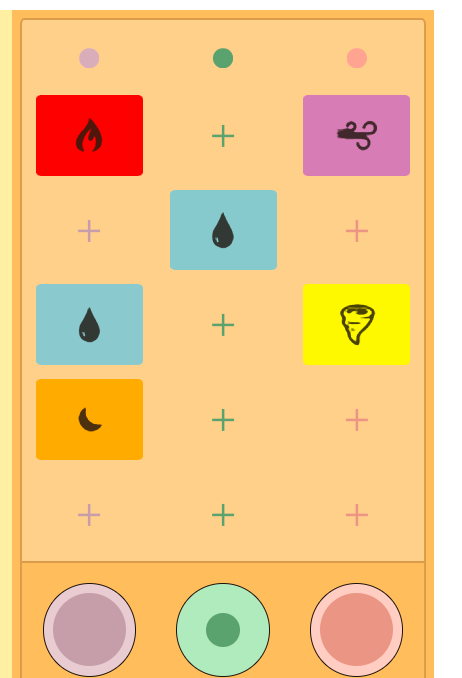| Add and swap effects clicking, change intensity by dragging vertically. Shift+Click to remove | 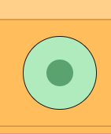| Drag vertically to change volume of the filter chain |
  
 

### Modulators
One main envelope, three assignable envelopes, two assignable lfos

|   |   |
|---|---|
| 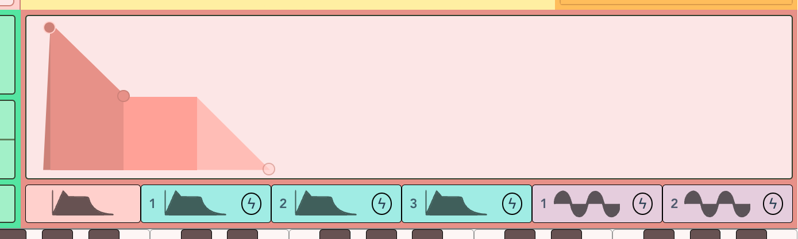 | Main Envelope: Relative to Synth Engine Volume (Draw the shape of Attack, Decay, Sustain and Release dragging the dots) |
| 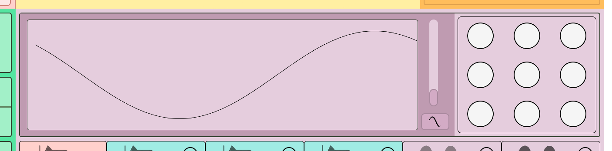 | LFO produces a periodic signal to modulate parameters. Vertical slider changes LFO speed, the button below changes waveform  |

|   |                                                          |   |                                                                                                         |
|---|----------------------------------------------------------|---|---------------------------------------------------------------------------------------------------------|
 | 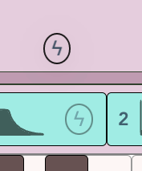 | Thunder icons are draggable | 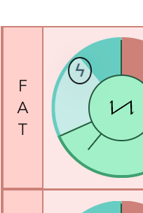 | Drop the thunder icon on: Synth Volume, Noise Volume, Synth Pitch or Filter Frequency to modulate the parameters |
|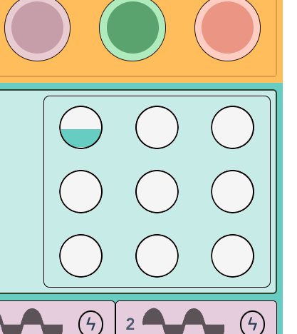 | Change modulation amount dragging the circles vertically | 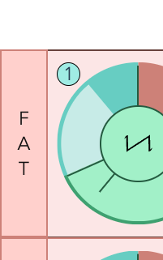 | The dot color and number indicates the modulator signal, Shift+Click on the dot to unlink the modulator |
| 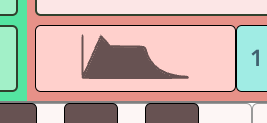 | Click mod icons to select the modulator shown            |
 
___ 

  
 

## Implementation
  
 

### Framework and Visuals:

- The framework of choice is [Vue](https://vuejs.org/)
- Visual effects are realized in plain CSS, without any external library.
- User Interface is responsive, with a fixed aspect ratio and dimensions relative to the window's width.

  
 

### Audio Core:
- Tone.js was our initial choice to write the audio logic. As the code kept growing, the complexity increased too and the stock Tone objects weren't sufficient. We decided to wrap our main audio engines in more sophisticated and modular custom objects:
    - **MyPolySynth** - A polyphonic, multi-engine synthesizer with 6 modulator signals and a noise generator included in each voice. Each MyPolySynth can be initialized with a custom number of voices and a defined destination.
    - **MyFilter** - A multi-type filter (HP, BAND, LP), based on Tone.Filter, with the addition of 1 envelope and 1 LFO to modulate the cutoff frequency.
    - **MyFx** - A multi-Fx object, unifying 6 Tone effects in a single component.
    
     
- Thanks to these wrappers, it's now possible to modulate synth pitch, synth volume, noise volume, and filter cutoff using both LFOs and envelopes. Simply set the modulation parameters and amount.
- Further updates aim to substitute Tone with the plain WebAudioAPI to improve latency and optimize the code further.

    &rarr; _[Audio Core Detailed Scheme](./res/Zenyth_Audio_Core.pdf)_

  
 

## Dependencies
- [Tone.js](https://tonejs.github.io) - Web Audio Framework
- [Vue.js](https://vuejs.org) - Web UI Framework
- [npm](https://www.npmjs.com/) - Package Manager

 

## Team
- Colombo Marco Furio - Routing, MyFx, Animated Graphics - `marcofurio.colombo@polimi.it`
- Guglielmo Fratticioli - Front End Developement and UI Design - `guglielmo.fratticioli@mail.polimi.it`
- Elia Pirrello - Audio Core Coding and Project Management - `elia.pirrello@mail.polimi.it`
